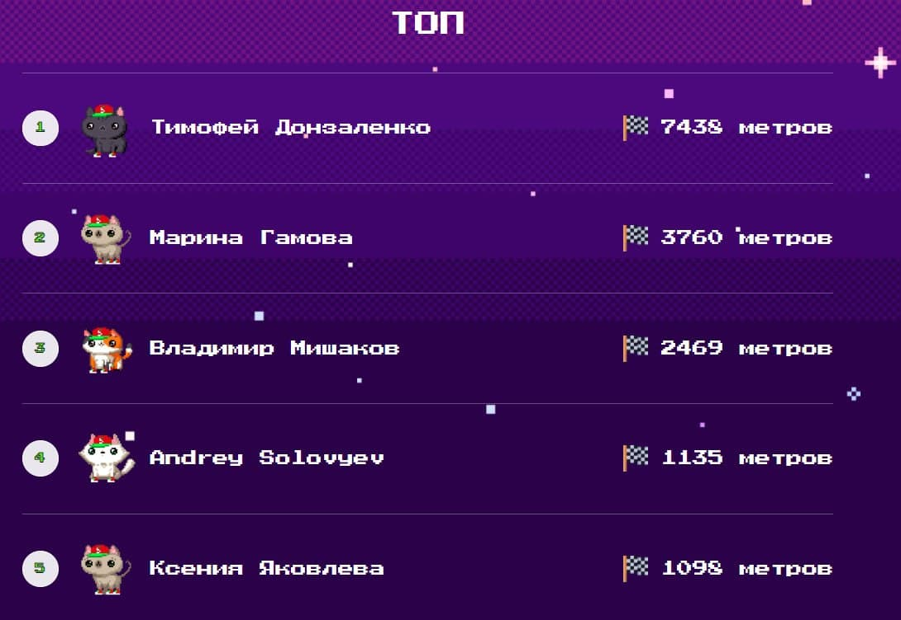

### Компьютерное зрение для прохождение игры от сети магазинов "Пятёрочка"

[Игра](https://racing.5ka.ru) на данный момент доступна частично. Из 5 уровней, доступен только 1.

Суть игры была пройти 5 уровней в стиле **"Subway Surfers"**. Собрать монеты, и
увернуться от монстров.   
С нарастающей скоростью забега, где на 5лвл
скорость просто не "человеческая":)

Собственно, спонтанно вызов был принят!) Код [ЗДЕСЬ.](./vision.py)  
Гифка работы ниже.  

К ~~сожалению~~ счастью остался кругляк с Telegram как это всё выглядило\работало.
Чёрный квадрат область "зрения". Выставил область, накинул 
обработку для "чёткого" зрения, получаем данные в виде матричного массива данных
по пикселям. Смотрим что там когда бежит монстр... Определил количество ненулевых 
элементов массива, от него и "уворачиваемся":)

  

P.S. По итогу я оказался там не один такой "игрок":) С начала был на 3-ем месте.
На следующий день поправил код, что то "подкрутил" на тот момент уже оказался 
на 8-ом, но вернулся в 5-ку лидеров:))) Далее к сожалению, упёрся в отсутствие 
времени, и как я понял в частоту проверки кадров либо в качестве получения данных.
Было пару идей как всё "ускорить" но акция игры окончилась, а уровни не доступны.

5-ое место. Аккаунт жены:) Вроде бы макс. был около 2500-3000 но возможности
посмотреть нету.

